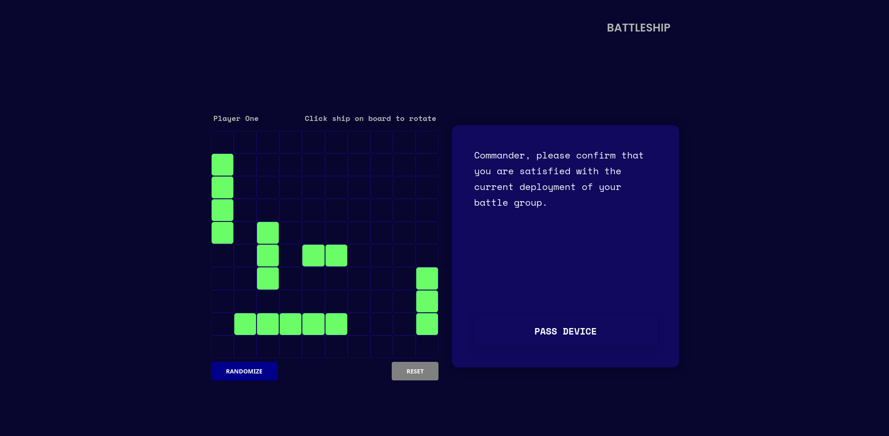

# TOP-template

## About

This project is a web-based implementation of the classic board game **Battleship**, created as part of **The Odin Project** curriculum.

Players can place ships, take turns guessing locations or play against **AI**, and experience interactive gameplay enhanced with sound effects.

The project emphasizes **JavaScript logic**, **DOM manipulation**, **testing** and **event-driven programming**, making it a great showcase of web development fundamentals.

## Features

- **Player vs Player:** Take turns against another human player.
- **Player vs Bot:** Challenge an AI opponent for a solo experience.
- **Interactive Gameplay:** Clickable game board for firing shots.
- **Analytics:** Track ship health and view detailed impact locations for both your ships and the enemy’s.
- **Audio Effects:** Enjoy sound effects for every action and event.
- **Ship Placement:** Manually place your ships on the board (desktop/PC only).
- **Ship Rotation:** Click on ships to rotate them before starting the game.

## Technologies Used
- **JavaScript (ES6+):** Implements game logic, DOM manipulation, and interactive elements.  
- **HTML5:** Provides the structure and content of the game.  
- **CSS:** Handles styling, layout, and responsive design.  
- **Webpack:** Bundles JavaScript modules for optimized delivery.  
- **Jest:** Performs testing of JavaScript code to ensure reliability.

## DEMO

## Demo

### Home

### Ship Placement

### Gameplay

### Pass Logic
  

## Sound Credits

### Sound Effects

- **Explosion**: Sound Effect by [Ahmed Abdulaal](https://pixabay.com/users/ahmed_abdulaal-49290858/?utm_source=link-attribution&utm_medium=referral&utm_campaign=music&utm_content=312361) from [Pixabay](https://pixabay.com//?utm_source=link-attribution&utm_medium=referral&utm_campaign=music&utm_content=312361)
- **Ship Destroyed**: Sound Effect by [freesound_community](https://pixabay.com/users/freesound_community-46691455/?utm_source=link-attribution&utm_medium=referral&utm_campaign=music&utm_content=42132) from [Pixabay](https://pixabay.com/sound-effects//?utm_source=link-attribution&utm_medium=referral&utm_campaign=music&utm_content=42132)
- **Miss**: Sound Effect by [Alexander Jauk](https://pixabay.com/users/alex_jauk-16800354/?utm_source=link-attribution&utm_medium=referral&utm_campaign=music&utm_content=147014) from [Pixabay](https://pixabay.com//?utm_source=link-attribution&utm_medium=referral&utm_campaign=music&utm_content=147014)

- Sound Effect by [Advik Singh](https://pixabay.com/users/scratchonix-50592769/?utm_source=link-attribution&utm_medium=referral&utm_campaign=music&utm_content=366448) from [Pixabay](https://pixabay.com//?utm_source=link-attribution&utm_medium=referral&utm_campaign=music&utm_content=366448)
- Sound Effect by [Eiklo](https://pixabay.com/users/eiklo-41248033/?utm_source=link-attribution&utm_medium=referral&utm_campaign=music&utm_content=303896) from [Pixabay](https://pixabay.com/sound-effects//?utm_source=link-attribution&utm_medium=referral&utm_campaign=music&utm_content=303896)
